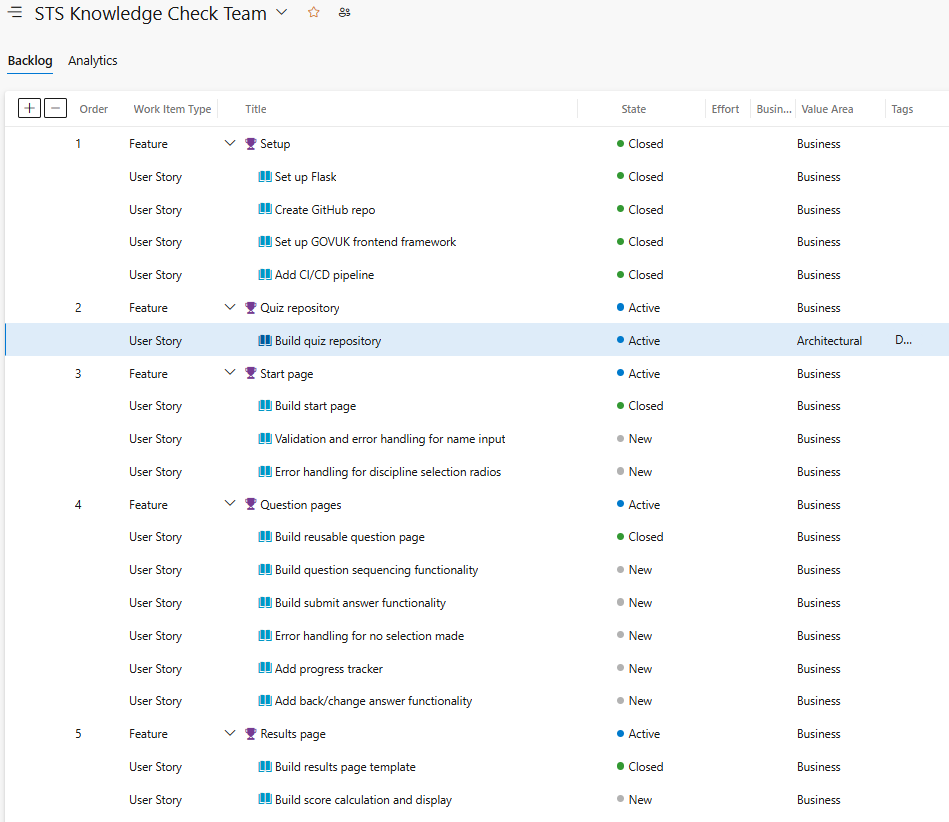
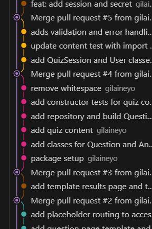
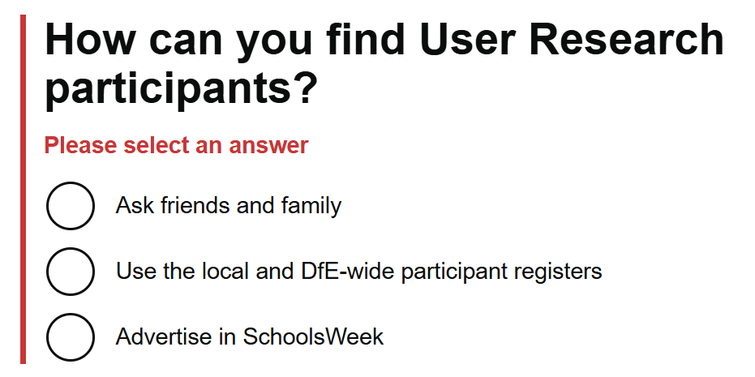
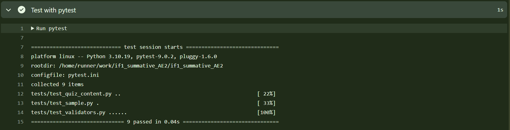
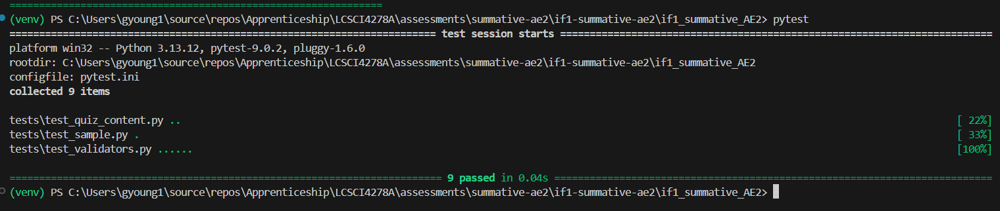
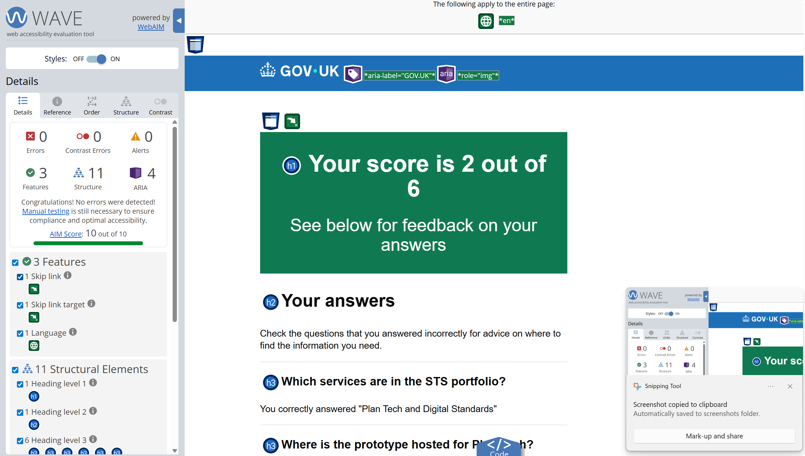

# Schools Technology Services (STS) Knowledge Check

## Introduction

Schools Technology Services (STS) is a programme of policy work and digital services within the Department for Education’s Digital Data Technology Directorate. STS’ mission is to help schools save time and money when they plan and implement technology, by supporting them to increase their digital maturity.
There are two key services in STS: Digital Standards, which develops and publishes the [digital and technology standards for schools and colleges](https://www.gov.uk/guidance/meeting-digital-and-technology-standards-in-schools-and-colleges/updates) to guide schools to improve their technology, and Plan Technology For Your School (referred to as Plan Tech), which allows schools to assess their current digital maturity and receive tailored, trackable steps towards meeting the standards. My role is as a Junior Software Developer in Plan Tech.

Plan Tech, currently in public beta, has an ambitious plan for new features supporting collaboration and prioritisation. It is delivered by a full Agile team comprised of managed service provider personnel (contractors) and a small group of civil servants. Contractors can be deployed, stood down or appointed to other teams within their provider’s contract at short notice, meaning that there are often new starters in the team who need to quickly familiarise themselves with the work landscape. Existing onboarding processes are largely administrative, with considerable onus placed on the new starter to educate themselves about the service.

The STS Knowledge Check supports new starters in the Plan Tech team to build their knowledge of the portfolio, the service and their role within the team, using a combination of general service knowledge and discipline-specific questions. Tailored feedback will direct users to authoritative sources of information to help them fill knowledge gaps quickly. The knowledge check would ideally take place early in the user’s employment to direct and accelerate their learning.

## Design

### GUI design and prototyping

As the STS knowledge check is intended for use in the civil service environment, I will use the [GOV.UK Design System](https://design-system.service.gov.uk/) and [frontend framework](https://github.com/alphagov/govuk-frontend) for the GUI. I used the [GOV.UK prototype kit](https://prototype-kit.service.gov.uk/docs/) to create a basic prototype for this app, which I uploaded as a [GitHub repo](https://github.com/gilaineyo/if1_summative_AE2_prototype) to use as a reference during the development phase. I used screenshots from the prototype to map the user journey on [Lucid](https://lucid.app/lucidspark/6384b51c-cf97-4066-ade5-6f433bf4b858/edit?viewport_loc=-2244%2C-876%2C8269%2C4676%2C0_0&invitationId=inv_9a860dd6-f96c-4694-b7c6-47f8ee8674b8) (Figure 1). 


**Figure 1**: Prototype screenshot with connected screens

The user enters their name and discipline on the start page, encountering an error if information is not entered correctly. When they have entered their information and selected `Start now`, they are directed to the question pages, again encountering the error component if they attempt to proceed further without selecting an answer. When properly submitted, the user cycles through the question pages until the final answer is submitted, when they are redirected to the results page.

### Requirements

Defining the requirements began with a mind mapping session using Lucid (Figure 1). Referring to the prototype, I assessed each page and determined the required behaviours. I also considered non-functional requirements such as testing, data storage, deployment, useability and accessibility.


**Figure 2**: Requirements mapping exercise

The mind mapping exercise was analysed and refined to generate the functional and non-functional requirements for the app (Table 1). Some initial ideas were discarded as not appropriate for a minimum viable product (MVP), such as allowing a user to traverse back through the question flow to change answers given previously. Other requirements, including those around input validation errors, were expanded and broken down into several requirements upon deeper analysis.

**Table 1**: Functional requirements for knowledge check app
| Type | ID | Area | Description |
| ---- | ---- | ---- | ---- |
| Functional  | FR1 | Start page | User is required to enter their name |
| Functional  | FR2 | Start page | User is required to enter their discipline |
| Functional  | FR3 | Error handling | Show error if user tries to submit invalid name |
| Functional  | FR4 | Error handling | Show error if user does not select a discipine |
| Functional  | FR5 | Error handling | Show error if user does not select an answer (question pages) |
| Functional  | FR6 | Questions | Display each question as an individual page |
| Functional  | FR7 | Questions | User can submit answer to question |
| Functional  | FR8 | Questions | Display conditional questions for each discipline |
| Functional  | FR9 | Results | Display score to user on completion |
| Functional  | FR10 | Results | Display individual question outcomes on completion |
| Functional  | FR11 | Results  | Display question feedback for each incorrectly-answered question |
| Non-functional  | NFR1 | Useability | Uses GOV.UK Design System components and styling |
| Non-functional  | NFR2 | Useability | Content conforms to GOV.UK style guide |
| Non-functional  | NFR3 | Useability | Useable interface on web and mobile |
| Non-functional  | NFR4 | Accessibility | WAVE Accessibility Impact Score > 6 on all pages |
| Non-functional  | NFR1 | Storage | Store user's name, discipline, score and timestamp |
| Non-functional  | NFR2 | Storage | Can read question and answer content from permanent storage |
| Non-functional  | NFR3 | Storage | Can write results to permanent storage |
| Non-functional  | NFR4 | Testing | Unit testing coverage > 80% |
| Non-functional  | NFR5 | Testing | Manual testing carried out |
| Non-functional  | NFR6 | Deployment | App deployed to Render for user access |

<br>
Following requirements definition, I created user stories and features in [Azure DevOps](https://azure.microsoft.com/en-us/products/devops) to manage the work required for the build (Figure 3) and supported this with a branching strategy, creating feature branches and merging each into `main` when complete (Figure 4).  

<br>


**Figure 3**: Backlog for STS knowledge check



**Figure 4**: Git commits timeline

### Tech stack outline

The requirement to use a GOV.UK design has a significant impact on the tech stack. As this is a Python app, the [Flask framework](https://flask.palletsprojects.com/en/stable/) is a logical choice, as it provides good support for the GOV.UK frontend.

To keep setup simple, compiled files will be used for [installing GOV.UK frontend]( https://design-system.service.gov.uk/get-started/production/), as this will reduce the installation steps and dependencies for local running.

[Pytest](https://docs.pytest.org/en/stable/index.html) is the chosen testing framework, as the syntax and style is intuitive and is suitable for use in an automated testing pipeline.

Permanent storage of questions, answers and results will use CSV files in the project structure, facilitated by the `csv` package, supplemented by `pathlib` and `datetime`. The `os` and `config` packages will be used to support session management, and the `re` package will support the use of regular expressions for name input validation.

Deployment of the app for access by users will be on [Render]( https://render.com/).

### Code design

This app is heavily dependant on content, so the code design addresses this by providing classes for questions and answers, both of which inherit from a `QuizContent` class containing their shared properties (Figure 5). The `QuizRepository` class handles the retrieval of data from CSV and, through its 'get' methods, creates instances of the `Question` and `Answer` classes for serving to the app.

  

**Figure 5**: Class diagram for content classes

## Development

The app is structured in a Flask standard format, with routes defined directly in `app.py` rendering defined HTML templates.

### Templates

The `base.html` template supplies the GOV.UK header and footer, loading assets from `static/`. Within `base.html`, a [Jinja](https://jinja.palletsprojects.com/en/stable/) code block represents the bespoke templates:

```html
<div class="govuk-width-container">
    <main class="govuk-main-wrapper" id="main-content">
    
    
    
    </main>
</div>
```

This allows bespoke templates (`start.html`, `question.html`, `results.html` and `error.html`) to extend `base.html`, being rendered in place of the block content. Jinja templating also allows rendering of dynamic values in a loop, such as the display of questions and answers in `results.html`:

```html

    <h3 class="govuk-heading-m govuk-!-padding-top-4">{{ q_and_a.question.text }}</h3>
    
        <p class="govuk-body">You correctly answered "{{ q_and_a.answer.text }}"</p>
    
        <p class="govuk-body">Your answer, "{{ q_and_a.answer.text }}" was incorrect. Visit the <a href="{{ q_and_a.question.wiki_href }}">{{ q_and_a.question.wiki_topic }}</a> section of the Wiki to find the answer.</p>
    
    <hr class="govuk-section-break govuk-section-break--visible"></hr>
    
```
Similar syntax is also used to add error component classes to existing form fields, providing the characteristic GOV.UK error format (Figure 6):

```html
<div class="govuk-form-group  govuk-form-group--error">
    <!-- non-error elements omitted -->
    
    <p id="name-error" class="govuk-error-message">
        <span class="govuk-visually-hidden">Error:</span> {{ error }}
    </p>
    
```


**Figure 6**: GOV.UK error component highlighting a missing radios entry

### Routes

There are three routes defined, aligned to the bespoke page templates, each with functions to handle requests to their endpoints. The `start` and `question` functions, both of which accept `GET` and `POST` requests, perform different actions depending on the type of request. For example, the name and discipline input validation is carried out within this conditional code block of the `start` function:

```Python
if (request.method == 'POST'):
        errors, valid = validate_form(request.form)
        if errors:
            return render_template(
                "start.html", 
                serviceName="STS knowledge check", 
                title="Start STS knowledge check",
                errors=errors)
        else:
            session["name"] = valid["name"]
            session["discipline"] = valid["discipline"]
            session["submitted_answers"] = []
            return redirect(url_for("question", index=1))
```

When receiving `GET` requests, each function renders the appropriate template:

```Python
    return render_template("question.html", 
                           serviceName="STS knowledge check", 
                           title="Question",
                           questionText=current_question.text,
                           questionId=current_question.id,
                           answers=current_answers,
                           index=index
                           )
```
### Exception handling

An `error.html` is defined based on the [GOV.UK 'there is a problem' pattern](https://design-system.service.gov.uk/patterns/problem-with-the-service-pages/) to support a simple global exception handler:

```Python
@app.errorhandler(Exception)
def handle_exception(e):
    return render_template("error.html", e=e), 500
```

This is currently applied to the CSV reader methods using `try` and `except` blocks:

```Python
try:
    project_root = Path(__file__).parent.parent
    questions_path = project_root / "data" / self.questions_file
    with open(questions_path, newline='') as f:
        # Method body omitted from code example
except FileNotFoundError:
    logger.error(f"Questions file not found at {questions_path}")
except Exception as e:
    logger.error(f"Unexpected error reading questions: {e}")
```

### Question sequencing

The app uses Flask's `session` module to store and pass values between functions and templates. This allows the app to build a list of answer ids for submitted answers, which can be retrieved, updated and overwritten by the `question` function. The function then increments the `index`, which is used to determine the next question in the `user_questions` list. If the new index is greater than the length of the `user_questions` list, this is the trigger to proceed to the results page; if not, the function is called again by redirecting to the same route, passing in the new index.

```Python
submitted_answers = session.get("submitted_answers", [])
submitted_answers.append(request.form.get("answerInput"))
session["submitted_answers"] = submitted_answers
new_index = int(index) + 1
if new_index > len(user_questions):
    return redirect(url_for('results'))
return redirect(url_for('question', index=new_index)) 
```
While the `user_questions` is zero-indexed, the `index` value starts at 1, and the `question` function retrieves the question with the `index - 1` position in the list. This implementation is to ensure that the URL appears as `/question/1` onwards, providing a more intuitive experience.

```Python
current_question = user_questions[int(index)-1]
```

### Validators

Validation is carried out on user inputs by lightweight functions in `validators.py` and is applied to the text input for the user's name and the radios for discipline and answers. The GOV.UK [error message](https://design-system.service.gov.uk/components/error-message/) and [error summary](https://design-system.service.gov.uk/components/error-summary/) require specific messages that should inform the user how to resolve the issue, so the `validate_name` function, for example, provides different error messages for different validation errors:

```Python
if (input.strip() == ""):
    return "Enter your name"
else:
    if (re.fullmatch(r'[a-zA-Z-\s]+', input.strip())):
        return input.strip()
    else:
        return "Your name must only contain letters, spaces and hyphens"
```

Error messages and/or valid values are returned as a tuple of dicts, with the strings produced by the validators stored on keys matching the name of the element that errored. 

```Python
    if not discipline_input:
        errors["discipline"] = "Select your discipline"
    else:
        valid["discipline"] = discipline_input

    name_result = validate_name(name_input)

    if (name_result != name_input.strip()):
        errors["name"] = name_result
    else:
        valid["name"] = name_result
    
    return errors, valid
```

This is so that the correct element can be identified and the conditional error class added:

```html

    <p id="name-error" class="govuk-error-message">
        <span class="govuk-visually-hidden">Error:</span> {{ errors.name }}
    </p>

```

### Content classes

A group of classes exists to retrieve, process and serve the question and answer content defined in CSV files stored in `data/`. The `QuizRepository` class brings together all content-related methods and performs the CSV operations, such as reading all answers below. 

```Python
    def read_answers_from_csv(self):
        # Docstring hidden for illustration purposes
        project_root = Path(__file__).parent.parent
        answers_path = project_root / "data" / self.answers_file
        with open(answers_path, newline='') as f:
            rows = csv.DictReader(f, delimiter=',')
            for row in rows:
                answer = Answer(
                    row['id'],
                    row['text'],
                    row['question_id'],
                    row['is_correct']
                )
                self.answers.append(answer)
```

Because all content is available within that class, `QuizRepository`'s methods can retrieve content in a range of ways, from filtering the questions according to the user's discipline (`get_questions_and_answers_for_user`), to retrieving a question-answer pair based on the id of the answer submitted by the user (`get_question_answer_by_answer_id`). 

## Testing

### Strategy and methodology

The testing strategy for this app consists of the following:
- Unit tests: implemented through an automated pipeline that runs tests on pull request. Combined with the branching strategy, this ensures that new code is tested before being merged into the `main` branch.
- Manual user testing: carried out on completion of each feature, to ensure that the app meets the defined requirements.
- Accessibility testing: accessibility evaluation will be carried out using the [WAVE](https://wave.webaim.org/) browser extension to provide an initial assessment of app accessibility.

### Test outcomes

Outcomes of manual testing are shown below (Table 2):

**Table 2**: Manual testing definition and outcomes
|Test ID|Requirement(s)    |Functionality |Description                             |Steps                                                                                                                                                                                                                                                                                        |Expected results                                                                                                                                                                                                            |Outcome|
|-------|------------------|--------------|----------------------------------------|---------------------------------------------------------------------------------------------------------------------------------------------------------------------------------------------------------------------------------------------------------------------------------------------|----------------------------------------------------------------------------------------------------------------------------------------------------------------------------------------------------------------------------|-------|
|EH1    |FR1, FR3          |Error handling|Blank name                              |1\. Load start page<br>2\. Leave name blank<br>3\. Select 'Technical' discipline<br>4\. Click 'Start now'                                                                                                                                                                                    |Error component appears around name input and at top of page, text: "Enter your name"                                                                                                                                       |Pass   |
|EH2    |FR1, FR3          |Error handling|Invalid characters in name              |1\. Load start page<br>2\. Enter name 'Abcd123'<br>3\. Select 'Technical' discipline<br>4\. Click 'Start now'                                                                                                                                                                                |Error component appears around name input and at top of page, text: "Your name must only contain letters, spaces and hyphens"                                                                                               |Pass   |
|EH3    |FR2, FR4          |Error handling|No discipline selected                  |1\. Load start page<br>2\. Enter name 'Diana'<br>3\. Do not select a discipline<br>4\. Click 'Start now'                                                                                                                                                                                     |Error component appears around discipline fieldset and at top of page, text: "Select your discipline"                                                                                                                       |Pass   |
|EH4    |FR5               |Error handling|No answer selected for question         |1\. Load start page<br>2\. Enter name 'Diana'<br>3\. Select 'Technical' for discipline.<br>4\. Click 'Start now'<br>5\. Do not select any answer on the question page<br>6\. Click 'Continue'                                                                                                |Error component appears around question and answer fieldset and at the top of page, text: "Please select an answer"                                                                                                         |Pass   |
|EH5    |FR1, FR2, FR3, FR4|Error handling|Handles multiple validation errors      |1\. Load start page<br>2\. Leave name blank<br>3\. Select 'Technical' discipline<br>4\. Click 'Start now'                                                                                                                                                                                    |Error component appears around name input and discipline fieldset and summary  at the top of page, collates messages, showing both: "Select your discipline" and "Enter your name"                                          |Pass   |
|Q1     |FR6, FR7, FR8     |Questions     |Correct content displayed for discipline|1\. Load start page<br>2\. Enter name and select "Technical" discipline, click 'Start now'<br>3\. Confirm content aligns with question 1 of questions.csv and answers.csv<br>4\. Select an answer and click 'Continue'<br>5\. Repeat steps 3-4 until results page is displayed               |Each question and set of answers aligns with expected content for 'Technical' discipline                                                                                                                                    |Pass   |
|Q2     |FR6, FR7, FR8     |Questions     |Correct content displayed for discipline|1\. Load start page<br>2\. Enter name and select "User-centred design(UCD)" discipline, click 'Start now'<br>3\. Confirm content aligns with question 1 of questions.csv and answers.csv<br>4\. Select an answer and click 'Continue'<br>5\. Repeat steps 3-4 until results page is displayed|Each question and set of answers aligns with expected content for 'User-centred design(UCD)' discipline                                                                                                                     |Pass   |
|Q3     |FR6, FR7, FR8     |Questions     |Correct content displayed for discipline|1\. Load start page<br>2\. Enter name and select "Product and delivery" discipline, click 'Start now'<br>3\. Confirm content aligns with question 1 of questions.csv and answers.csv<br>4\. Select an answer and click 'Continue'<br>5\. Repeat steps 3-4 until results page is displayed    |Each question and set of answers aligns with expected content for 'Product and delivery' discipline                                                                                                                         |Pass   |
|R1     |FR9               |Results       |Display correct score                   |1\. Load start page<br>2\. Enter name and select "Product and delivery" discipline, click 'Start now'<br>4\. Referring to answers.csv, answer all questions by selecting any 4 correct answers and any 2 incorrect answers<br>5\. Continue until results page displayed                      |Results page shows success panel component with text: "Your score is 4 out of 6"                                                                                                                                            |Pass   |
|R2     |FR10, FR11        |Results       |Display feedback for incorrect answers  |1\. Load start page<br>2\. Enter name and select "Product and delivery" discipline, click 'Start now'<br>4\. Referring to answers.csv, answer all questions incorrectly<br>5\. Continue until results page displayed                                                                         |Results page shows success panel component with text: "Your score is 0 out of 6". The 'Your answers' summary shows message advising of incorrect response, with advice text and link matching those defined in questions.csv|Pass   |
-----
<br>
The following screenshots show unit tests running in GitHub Actions (Figure 7) and locally (Figure 8):  


**Figure 7**: Unit tests running in GitHub Actions


**Figure 8**: Unit tests running locally

An accessibility evaluation was carried out using the WAVE browser extension, to provide a guide to resolving any common accessibility issues. Some issues related to labelling were resolved during development. All pages including error-displaying versions, were checked and received a [WAVE Accessibility IMpact (AIM)](https://wave.webaim.org/aimscore) score of 10, meeting non-functional requirement NFR4 (Figure 9).


**Figure 9**: WAVE accessibility evaluation of the results page


## Documentation

### User documentation

Visit [Render](https://if1-summative-ae2.onrender.com/) to use the live app and follow the on-screen instructions.
1. Enter your name and select the discipline (Technical, User-centred design or Product and delivery) that your role is part of.
2. Click 'Start now'.
3. Select an answer and click 'Continue' for each question presented (there will be 6 questions in total).
4. Review the results page that will display after the final question.  

*Please note: links contained in the feedback are for demonstration purposes only as the STS Wiki is authenticated.*

### Technical documentation

This app uses Python v3.13.12, Flask v3.1.3 and pytest v9.0.2. For ease of installation the GOV.UK front-end framework is installed using compiled files, following [this installation documentation](https://frontend.design-system.service.gov.uk/install-using-precompiled-files/).

To install and run this project locally, first clone this repo:
```bash
git clone https://github.com/gilaineyo/if1_summative_AE2.git
```

Navigate to the project's root directory and install a virtual environment:
```bash
cd if1_summative_AE2
python -m venv venv
```
*Note: the command below is Windows-specific, for other operating systems refer to the [Python documentation on virtual environments](https://docs.python.org/3/library/venv.html)*.

Activate the virtual environment:
```bash
venv\Scripts\activate
```
Once active, install dependencies:
```bash
pip install flask
pip install pytest
```
To facilitate Flask's `session` functionality, a `config.py` file has been included, which sets a `SECRET_KEY`. If you wish, you can set an environment variable to handle this key, or the default key will be applied.

Refer to the Development section of this README for a detailed description of the app's code and functionality.

## Evaluation

### What went well

The design for the content classes supported the build well and it was easy to incorporate new methods in `QuizRepository`. This made development of the more complex functionality, such as calculating the score and displaying questions, answers and feedback very straightforward, as the framework needed to pull this information together was already there. Using Azure DevOps and clearly defining the requirements and user stories before beginning development was helpful to structure the work in a logical and consistent, ensuring nothing was missed. 

### What could be improved

My original design was more complex that it appeared when placed in the context of working with a new framework, so some initial requirements were de-prioritised for the MVP, such as back links to allow answers to be changed. My lack of experience with Flask meant re-working parts of the implementation, for example using the `session` package was a pivot away from an original plan to create a Session class to store user information. This lack of experience also impacted my confidence in using test-driven development, as I was unsure of how to achieve what I needed to, and this resulted in my unit test coverage being low. When building an app using a new framework again, I will spend time experimenting with smaller builds to gain knowledge and experience.

### Future developments

The next step for the STS knowledge check, beyond implementing the de-prioritised features, would be full user testing, combined with user research to understand the knowledge areas that would most benefit from inclusion in the content. Secure hosting would allow for more sensitive information to be included, which can be achieved in the Department for Education through Microsoft Azure. An SQL storage implementation would be supported by the Azure instance and would better support the expansion of content, potentially to new business areas.
