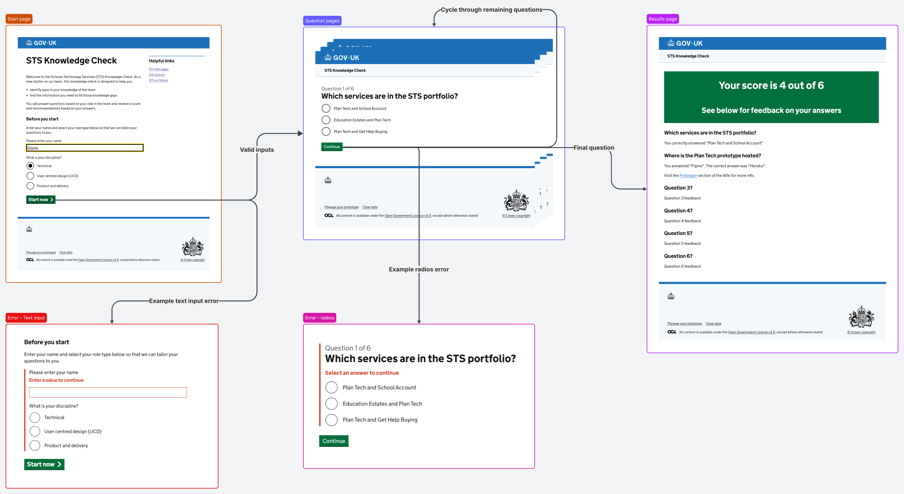
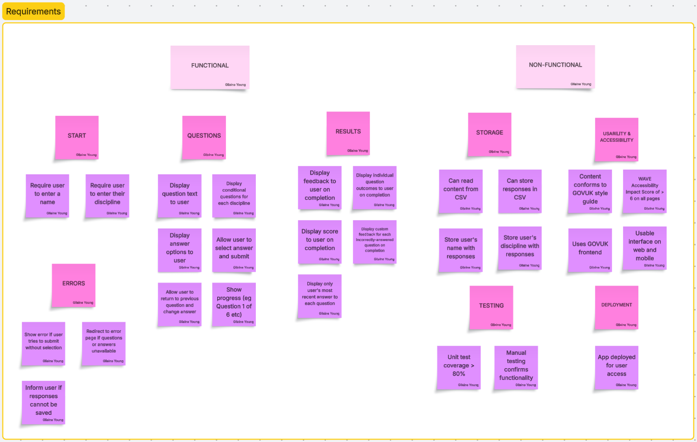
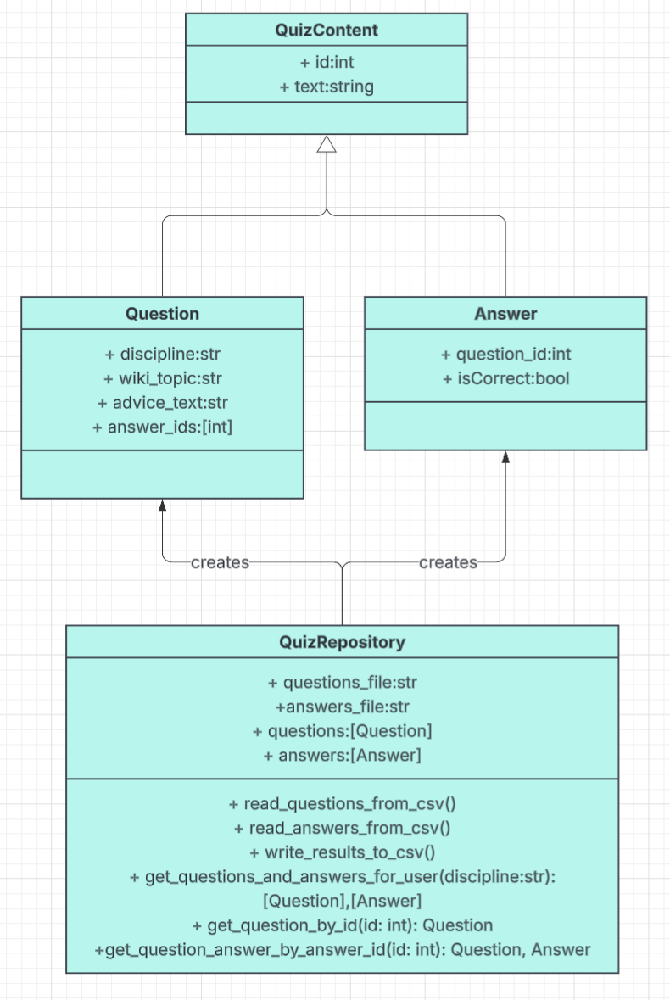

# Schools Technology Services (STS) Knowledge Check

## Introduction

Schools Technology Services (STS) is a programme of policy work and digital services within the Department for Education’s Digital Data Technology Directorate. STS’ mission is to help schools save time and money when they plan and implement technology, by supporting them to increase their digital maturity.
There are two key services in STS: Digital Standards, which develops and publishes the [digital and technology standards for schools and colleges](https://www.gov.uk/guidance/meeting-digital-and-technology-standards-in-schools-and-colleges/updates) to guide schools to improve their technology, and Plan Technology For Your School (referred to as Plan Tech), which allows schools to assess their current digital maturity and receive tailored, trackable steps towards meeting the standards. My role is as a Junior Software Developer in Plan Tech.

Plan Tech is currently in public beta and has an ambitious plan for new features supporting collaboration between schools and multi-academy trusts. It is delivered by a full Agile team comprised of managed service provider personnel (contractors) with a small group of civil servants spread across disciplines. Contractors can be deployed, stood down or appointed to other teams within their provider’s contract at short notice, meaning that there are often new starters in the team who need to quickly familiarise themselves with the work landscape. Existing onboarding processes are largely administrative, with considerable onus placed on the new starter to educate themselves about the service.

The STS Knowledge Check supports new starters in the Plan Tech team to build their knowledge of the portfolio, the service and their role within the team, using a combination of general service knowledge and discipline-specific questions. Tailored feedback will direct users to authoritative sources of information to help them fill knowledge gaps quickly. The knowledge check would ideally take place early in the user’s employment to direct and accelerate their learning.

## Design

### GUI design and prototyping

As the STS knowledge check is intended for use in the civil service environment, I decided it would be appropriate to use the [GOV.UK Design System](https://design-system.service.gov.uk/) and [frontend framework](https://github.com/alphagov/govuk-frontend) for the GUI. I used the [GOV.UK prototype kit](https://prototype-kit.service.gov.uk/docs/) to create a basic prototype for this app, which I uploaded as a [GitHub repo](https://github.com/gilaineyo/if1_summative_AE2_prototype) to use as a reference during the development phase. I used screenshots from the prototype to map the user journey on [Lucid](https://lucid.app/lucidspark/6384b51c-cf97-4066-ade5-6f433bf4b858/edit?viewport_loc=-2244%2C-876%2C8269%2C4676%2C0_0&invitationId=inv_9a860dd6-f96c-4694-b7c6-47f8ee8674b8) (Figure 1). 


**Figure 1**: Prototype screenshot with connected screens

The user begins at the start page, entering their name and discipline, encountering an error component if information is not entered correctly. When they have entered their information and selected `Start now`, they are directed to the question pages, again encountering the error component if they attempt to proceed further without selecting an answer. When answers are selected, the user cycles through the question pages until the final answer is submitted, when they are redirected to the results page.

### Requirements

Defining the requirements for the knowledge check began with a mind mapping session using Lucid (Figure 1). Referring to the prototype, I assessed each page and determined the required behaviours for the finished app. I also considered non-functional requirements such as testing, data storage, deployment, useability and accessibility.


**Figure 2**: Requirements mapping exercise

The mind mapping exercise was analysed and refined to generate the functional and non-functional requirements for the app (Table 1). Some initial ideas were discarded as not appropriate for a minimum viable product (MVP), such as allowing a user to traverse back through the question flow to change answers given previously. Other requirements, including those around input validation errors, were expanded and broken down into several requirements upon deeper analysis.

**Table 1**: Functional requirements for knowledge check app
| Type | ID | Area | Description |
| ---- | ---- | ---- | ---- |
| Functional  | FR1 | Start page | User is required to enter their name |
| Functional  | FR2 | Start page | User is required to enter their discipline |
| Functional  | FR3 | Error handling | Show error if user tries to submit invalid name |
| Functional  | FR4 | Error handling | Show error if user does not select a discipine |
| Functional  | FR5 | Error handling | Show error if user does not select an answer (question pages) |
| Functional  | FR6 | Questions | Display each question as an individual page |
| Functional  | FR7 | Questions | User can submit answer to question |
| Functional  | FR8 | Questions | Display conditional questions for each discipline |
| Functional  | FR9 | Results | Display score to user on completion |
| Functional  | FR10 | Results | Display individual question outcomes on completion |
| Functional  | FR11 | Results  | Display question feedback for each incorrectly-answered question |
| Non-functional  | NFR1 | Useability | Uses GOV.UK Design System components and styling |
| Non-functional  | NFR2 | Useability | Content conforms to GOV.UK style guide |
| Non-functional  | NFR3 | Useability | Useable interface on web and mobile |
| Non-functional  | NFR4 | Accessibility | WAVE Accessibility Impact Score > 6 on all pages |
| Non-functional  | NFR1 | Storage | Store user's name, discipline, score and timestamp |
| Non-functional  | NFR2 | Storage | Can read question and answer content from permanent storage |
| Non-functional  | NFR3 | Storage | Can write results to permanent storage |
| Non-functional  | NFR4 | Testing | Unit testing coverage > 80% |
| Non-functional  | NFR5 | Testing | Manual testing carried out |
| Non-functional  | NFR6 | Deployment | App deployed to Render for user access |

### Tech stack outline

The requirement to use a GOV.UK design has a significant impact on the tech stack. As this is a Python app, the [Flask framework](https://flask.palletsprojects.com/en/stable/) is a logical choice, as it provides good support for the GOV.UK frontend and has been used in other GOV.UK projects. Flask is also well documented, meaning that startup will be relatively straightforward.

There are two options for installing GOV.UK components and styling: using npm or using compiled files, as outlined in the [GOV.UK documentation](https://design-system.service.gov.uk/get-started/production/). To keep setup simple, I have decided to use compiled files, as this will reduce the installation steps and dependencies for future local installations. This will mean some constraints on the build, e.g. it will not be possible to design custom components in the same style and palette, but there is no clear requirement to do so at this stage.

[Pytest](https://docs.pytest.org/en/stable/index.html) is the chosen testing framework, as the syntax and style is intuitive and is suitable for use in an automated testing pipeline.

Permanent storage of questions, answers and results will use CSV files in the project structure, facilitated by the `csv` package, supplemented by `pathlib` and `datetime`. The `os` and `config` packages will be used to support session management, and the `re` package will support the use of regular expressions for name input validation.

Deployment of the app for access by users will be on [Render]( https://render.com/).

### Code design

This app is heavily dependant on content, so the code design addresses this by providing classes for questions and answers, both of which inherit from a `QuizContent` class containing their shared properties (Figure 3). The `QuizRepository` class handles the retrieval of data from CSV and, through its 'get' methods, creates instances of the `Question` and `Answer` classes for serving to the app.


**Figure 3**: Class diagram for content classes

## Development


## Testing

## Documentation

### User documentation

Visit [Render](https://if1-summative-ae2.onrender.com/) to use the live app and follow the on-screen instructions.
1. Enter your name and select the discipline (Technical, User-centred design or Product and delivery) that your role is part of.
2. Click 'Start now'.
3. Select an answer and click 'Continue' for each question presented (there will be 6 questions in total).
4. Review the results page that will display after the final question.  

*Please note: links contained in the feedback are for demonstration purposes only as the STS Wiki is authenticated.*

### Technical documentation

This app uses Python v3.13.12, Flask v3.1.3 and pytest v9.0.2. For ease of installation the GOV.UK front-end framework is installed using compiled files, following [this installation documentation](https://frontend.design-system.service.gov.uk/install-using-precompiled-files/).

To install and run this project locally, first clone this repo:
```bash
git clone https://github.com/gilaineyo/if1_summative_AE2.git
```

Navigate to the project's root directory and install a virtual environment:
```bash
cd if1_summative_AE2
python -m venv venv
```
*Note: the command below is Windows-specific, for other operating systems refer to the [Python documentation on virtual environments](https://docs.python.org/3/library/venv.html)*.

Activate the virtual environment:
```bash
venv\Scripts\activate
```
Once active, install dependencies:
```bash
pip install flask
pip install pytest
```
To facilitate Flask's `session` functionality, a `config.py` file has been included, which sets a `SECRET_KEY`. If you wish, you can set an environment variable to handle this key, or the default key will be applied.

## Evaluation
